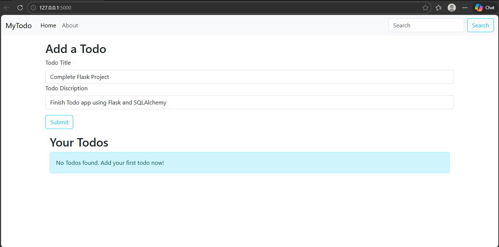
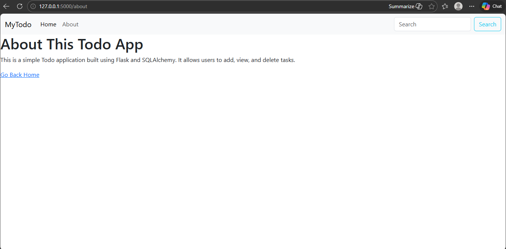

# 📝 Flask Todo App

A simple **Todo web application** built using **Flask** and **SQLite**.  
This project allows users to add, view, and delete todo tasks using a clean web interface.

---

## 🚀 Features

- Add new todo items
- View all todos
- Delete todos
- About page
- Uses Flask + Flask-SQLAlchemy
- SQLite database
- Clean UI with reusable navbar (base.html)

---

## 🛠️ Tech Stack

- Python
- Flask
- Flask-SQLAlchemy
- SQLite
- HTML, CSS

---

## 📸 Screenshots

### Home Page

### Add Todo

### About Page

---
